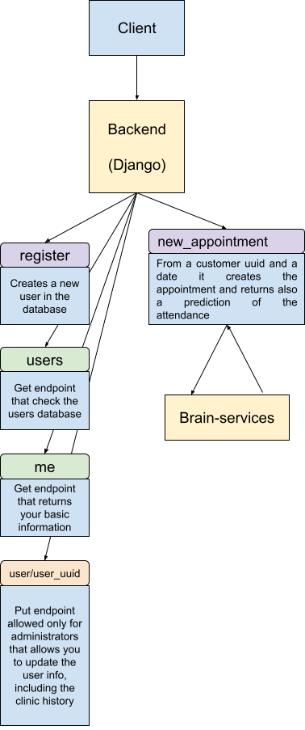
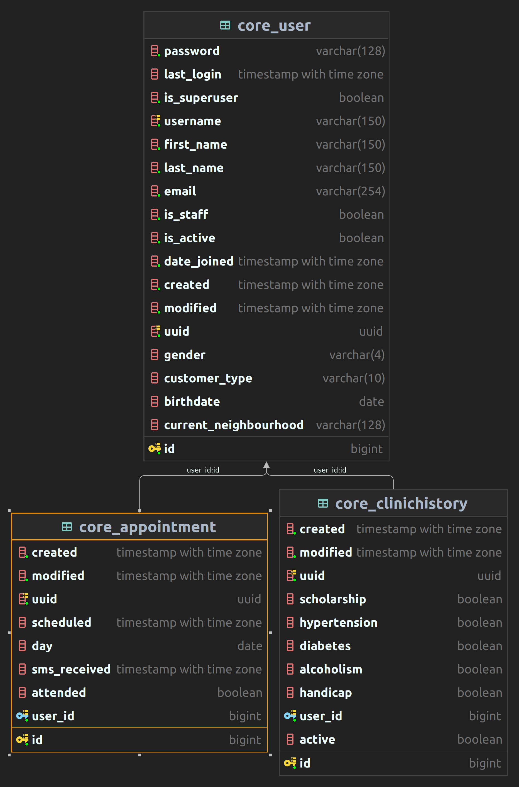

# Backend
This repo is the backend for the Senniors tests.

It depends on the [brain services](https://github.com/martingaldeca/senniors-brain-services) in order to call the predictions

When that service is called with the required data it provides a prediction about the user attendance to an appointment.

## Requirements
The following requirements are needed:

    docker
    docker-compose

But in order to perform debug tasks and also to simplify the work is highly recommended to have also these dependencies:

    make

## Installation
If you have the minimum requirements, run the project is a piece of cake, just run the following:

```shell
docker-compose up -d
```

And if you have make, is even easier:

```shell
make
```

And voila!, your project will be running in a docker container


## Configuration
In order to debug the backend locally is highly recommended to update some env values.

All the env values associated to the brain services in local should be updated, `BRAIN_SERVICES_URL` is the most critical to update

The rest of the project is configured ok, but you can update some values, for example the admin superuser, by default is `admin` with password `root1234`

## How it works?
This is a django project dockerized with a postgres database, so once it is started you can check if everything is ok going to the [local admin](http://localhost:3141/senniors_admin/)

If you can see the admin everything is ok, if not, you should check the logs 
```shell
make logs
```

The main API architecture is as follows:



But you can check it better with the following interfaces:
* [swagger](http://localhost:3141/api/schema/swagger-ui/)
* [redoc](http://localhost:3141/api/schema/redoc/)

The database is quite simple as follows:


## Tests
The project only has unit tests, and to check that all tests are ok just exec the following:

```shell
make test
```

or

```shell
docker exec senniors_backend python -m pytest --log-cli-level=ERROR --disable-pytest-warnings
```

# Next steps
* First we should create a CI/CD, maybe with jenkins and a Jenkinsfile, that pass all the tests if needed and deploy the project in different environments.
* Then we need to create E2E test cases, maybe with postman and a newman container.
* Upgrade the models, creating a model of hospitals for example
* Adding extra logic and extra endpoints (create user from new appointment endpoint for example, extra filters in endpoints...)
